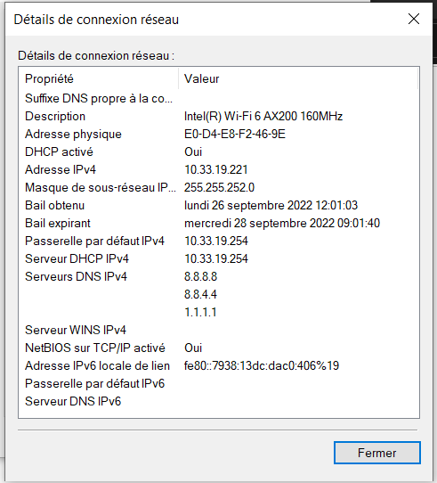
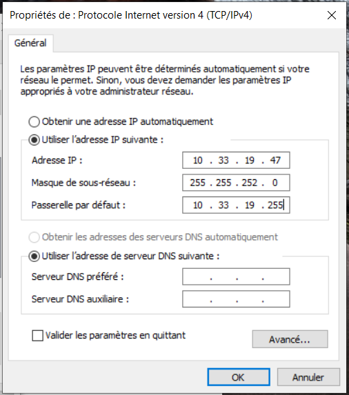
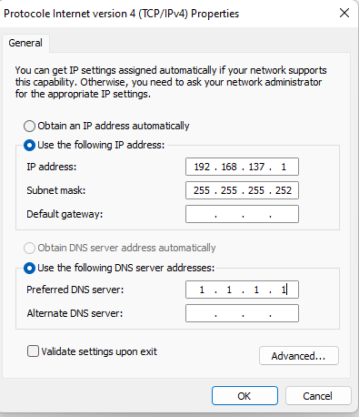
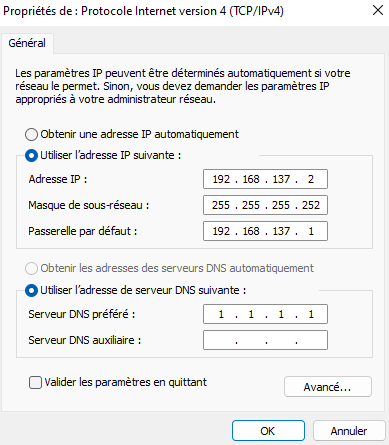

# TP1 - Mise en jambes

# I. Exploration locale en solo

## 1. Affichage d'informations sur la pile TCP/IP locale

### A - En ligne de commande

#### - Affichez les infos des cartes réseau de votre PC

```bash
# nom, adresse MAC et adresse IP de l'interface WiFi

PS C:\Users\33785> ipconfig /all

Configuration IP de Windows

[...]

Carte réseau sans fil Wi-Fi :

   Suffixe DNS propre à la connexion. . . :
   # nom de l'interface WiFi
   Description. . . . . . . . . . . . . . : Intel(R) Wi-Fi 6 AX200 160MHz
   # adresse MAC de l'interface WiFi
   Adresse physique . . . . . . . . . . . : E0-D4-E8-F2-46-9E
   DHCP activé. . . . . . . . . . . . . . : Oui
   Configuration automatique activée. . . : Oui
   Adresse IPv6 de liaison locale. . . . .: fe80::7938:13dc:dac0:406%19(préféré)
   # adresse IP de l'interface WiFi
   Adresse IPv4. . . . . . . . . . . . . .: 10.33.19.221(préféré)
   Masque de sous-réseau. . . . . . . . . : 255.255.252.0
   Bail obtenu. . . . . . . . . . . . . . : lundi 26 septembre 2022 12:01:03
   Bail expirant. . . . . . . . . . . . . : mercredi 28 septembre 2022 09:01:41
   Passerelle par défaut. . . . . . . . . : 10.33.19.254
   Serveur DHCP . . . . . . . . . . . . . : 10.33.19.254
   IAID DHCPv6 . . . . . . . . . . . : 165729512
   DUID de client DHCPv6. . . . . . . . : 00-01-00-01-27-E6-CA-8A-00-6F-00-00-0A-DF
   Serveurs DNS. . .  . . . . . . . . . . : 8.8.8.8
                                       8.8.4.4
                                       1.1.1.1
   NetBIOS sur Tcpip. . . . . . . . . . . : Activé
```

```bash
# nom, adresse MAC et adresse IP de l'interface Ethernet

Pas d'interface Ethernet
```

#### - Affichez votre gateway

```bash
PS C:\Users\33785> ipconfig

[...]

Carte réseau sans fil Wi-Fi :

   [...]
   Passerelle par défaut. . . . . . . . . : 10.33.19.254
```

### B - En graphique (GUI : Graphical User Interface)

#### - Trouvez comment afficher les informations sur une carte IP (change selon l'OS)

```bash
Sous Windows

- Aller dans le panneau de configuration
- Aller dans Réseau et Internet
- Cliquer sur la carte concernée
- Cliquer sur "Détails"
```

<div align="center">

</div>

### Questions

```
La gateway du réseau d'Ynov nous sert à aller sur internet.
```

## 2. Modifications des informations

### A - Modification d'adresse IP (part 1)

```bash
Sous Windows

- Aller dans le panneau de configuration
- Aller dans Réseau et Internet
- Aller dans Modifier les paramètres de la page 
- Cliquer sur la carte concernée
- Cliquer sur "Propriétés"
- Cliquer sur "Protocole Internet Version 4 (TCP/IPv4)"
- Changer l'adresse IP
```

<div align="center">

</div>


```bash
Il est possible de perdre l'accès à internet si l'adresse IP a déjà été selectionnée, la première personne a avoir choisi l'adresse IP sera prioritaire et la deuxième n'aura donc plus de réseau.
```

# II. Exploration locale en duo

### 1. Prérequis

Lu.

### 2. Câblage

Fait.

### 3. Modification d'adresse IP

<div align="center">

</div>

<div align="center">

</div>

```bash
# vérification des changements sur le premier ordinateur
C:\Users\Matteo>ipconfig

Configuration IP de Windows


Carte Ethernet Ethernet :

   Suffixe DNS propre à la connexion. . . :
   Adresse IPv6 de liaison locale. . . . .: fe80::e1db:4bc1:6c23:6d5f%10
   Adresse IPv4. . . . . . . . . . . . . .: 192.168.137.2
   Masque de sous-réseau. . . . . . . . . : 255.255.255.252
   Passerelle par défaut. . . . . . . . . : 192.168.137.1
```

```bash
# vérification des changements sur le deuxième ordinateur
Ethernet adapter Ethernet:

   Connection-specific DNS Suffix  . :
   Link-local IPv6 Address . . . . . : fe80::dd19:ecee:b04e:a3e7%22
   IPv4 Address. . . . . . . . . . . : 192.168.137.1
   Subnet Mask . . . . . . . . . . . : 255.255.255.252
```   

```bash
# ping du PC1 vers le PC2
PS C:\Users\Dreasy> ping 192.168.137.2

Pinging 192.168.137.2 with 32 bytes of data:
Reply from 192.168.137.2: bytes=32 time<1ms TTL=128
Reply from 192.168.137.2: bytes=32 time=2ms TTL=128
Reply from 192.168.137.2: bytes=32 time=1ms TTL=128
Reply from 192.168.137.2: bytes=32 time=1ms TTL=128

Ping statistics for 192.168.137.2:
    Packets: Sent = 4, Received = 4, Lost = 0 (0% loss),
Approximate round trip times in milli-seconds:
    Minimum = 0ms, Maximum = 2ms, Average = 1ms
```

```bash
# ping du PC2 vers le PC1
C:\Users\Matteo>ping 192.168.137.1

Envoi d’une requête 'Ping'  192.168.137.1 avec 32 octets de données :
Réponse de 192.168.137.1 : octets=32 temps=1 ms TTL=128
Réponse de 192.168.137.1 : octets=32 temps=1 ms TTL=128
Réponse de 192.168.137.1 : octets=32 temps=2 ms TTL=128
Réponse de 192.168.137.1 : octets=32 temps=1 ms TTL=128

Statistiques Ping pour 192.168.137.1:
    Paquets : envoyés = 4, reçus = 4, perdus = 0 (perte 0%),
Durée approximative des boucles en millisecondes :
    Minimum = 1ms, Maximum = 2ms, Moyenne = 1ms
```

```bash
# affichage et consultation de la table ARP du premier ordinateur
Interface: 192.168.137.1 --- 0x16
  Internet Address      Physical Address      Type
  192.168.137.2           04-d4-c4-e6-15-34     dynamic
  192.168.137.3           ff-ff-ff-ff-ff-ff     static
  224.0.0.22            01-00-5e-00-00-16     static
  224.0.0.251           01-00-5e-00-00-fb     static
  224.0.0.252           01-00-5e-00-00-fc     static
  239.255.255.250       01-00-5e-7f-ff-fa     static
```

```bash
# affichage et consultation de la table ARP du second ordinateur
C:\Users\Matteo>arp -a

[...]

Interface : 192.168.137.2 --- 0xa
  Adresse Internet      Adresse physique      Type
  192.168.137.1           a0-ce-c8-38-0c-17     dynamique
  192.168.137.3           ff-ff-ff-ff-ff-ff     statique
  224.0.0.22            01-00-5e-00-00-16     statique
  224.0.0.251           01-00-5e-00-00-fb     statique
  224.0.0.252           01-00-5e-00-00-fc     statique
  239.255.255.250       01-00-5e-7f-ff-fa     statique
  255.255.255.255       ff-ff-ff-ff-ff-ff     statique
```

## 4. Utilisation d'un des deux comme gateway

```bash
#requête vers un serveur connu
C:\Users\Matteo>ping 1.1.1.1

Envoi d’une requête 'Ping'  1.1.1.1 avec 32 octets de données :
Réponse de 1.1.1.1 : octets=32 temps=24 ms TTL=54
Réponse de 1.1.1.1 : octets=32 temps=21 ms TTL=54
Réponse de 1.1.1.1 : octets=32 temps=22 ms TTL=54
Réponse de 1.1.1.1 : octets=32 temps=22 ms TTL=54

Statistiques Ping pour 1.1.1.1:
    Paquets : envoyés = 4, reçus = 4, perdus = 0 (perte 0%),
Durée approximative des boucles en millisecondes :
    Minimum = 21ms, Maximum = 24ms, Moyenne = 22ms
```

```bash
# vérification du passage des paquets par la passerelle
C:\Users\Matteo>tracert 1.1.1.1

Détermination de l’itinéraire vers one.one.one.one [1.1.1.1]
avec un maximum de 30 sauts :

  1    <1 ms     *        2 ms  DREASY [192.168.137.1]
  2     *        *        *     Délai d’attente de la demande dépassé.
  3     5 ms     5 ms     5 ms  10.33.19.254
  4     6 ms     6 ms     6 ms  137.149.196.77.rev.sfr.net [77.196.149.137]
  5    14 ms    12 ms    12 ms  108.97.30.212.rev.sfr.net [212.30.97.108]
```

## 5. Petit chat privé

```bash
# informations visibles depuis le pc serveur

PS C:\Users\Dreasy> ncat -l -p 8888
Coucou
Miew
g fAIm
```

```bash
# informations visibles depuis le pc client

PS C:\Users\Matteo> ncat  192.168.137.1 8888
libnsock ssl_init_helper(): OpenSSL legacy provider failed to load.

Coucou
Miew
g fAIm
```

Entre temps nous avons installé le bon netcat :)

# III. Manipulations d'autres outils/protocoles côté client

## 1 - DHCP

```bash
# affichage de l'adresse IP du DHCP

Carte réseau sans fil Wi-Fi :

[...]
   Passerelle par défaut. . . . . . . . . : 10.33.19.254
```

```bash
# Le bail DHCP expire le jeudi 29 septembre 2022 à 9h16. Il a une durée de 24 heures qui peut être modifié par un administrateur.
C:\Users\33785>ipconfig /all

Configuration IP de Windows

[...]
   Bail obtenu. . . . . . . . . . . . . . : mercredi 28 septembre 2022 09:16:42
   Bail expirant. . . . . . . . . . . . . : jeudi 29 septembre 2022 09:16:42
[...]
```

## 2 - DNS

```bash
# adresse du serveur DNS que connait mon ordinateur
Carte réseau sans fil Wi-Fi :

[...]
   Serveurs DNS. . .  . . . . . . . . . . : 8.8.8.8
                                       8.8.4.4
                                       1.1.1.1
```

```bash
# affichage de l'adresse IP de google.com, on fait la requête au serveur DNS de google, l'adresse IP de google.com est 142.250.75.228. 

C:\Users\33785>nslookup www.google.com
Serveur :   dns.google
Address:  8.8.8.8

Réponse ne faisant pas autorité :
Nom :    www.google.com
Addresses:  2a00:1450:4007:80d::2004
          142.250.75.228
```

```bash
# affichage de l'adresse IP d'ynov.com, on fait la requête au serveur DNS de google, l'adresse IP d'ynov.com est 104.26.10.233.

C:\Users\33785>nslookup www.ynov.com
Serveur :   dns.google
Address:  8.8.8.8

Réponse ne faisant pas autorité :
Nom :    www.ynov.com
Addresses:  2606:4700:20::ac43:4ae2
          2606:4700:20::681a:be9
          2606:4700:20::681a:ae9
          172.67.74.226
          104.26.11.233
          104.26.10.233
```

```bash
L'adresse IP du serveur auprès duquel on fait des requêtes est celle du serveur DNS de google, 8.8.8.8
```

```bash
# le nom de domaine associé à l'adresse IP est host-78-74-21-21.homerun.telia.com
C:\Users\33785>nslookup 78.74.21.21
Serveur :   dns.google
Address:  8.8.8.8

Nom :    host-78-74-21-21.homerun.telia.com
Address:  78.74.21.21
```

```bash
# il n'y a pas de nom de domaine associé à cette adresse IP

C:\Users\33785>nslookup 92.146.54.88
Serveur :   dns.google
Address:  8.8.8.8

*** dns.google ne parvient pas à trouver 92.146.54.88 : Non-existent domain
```
